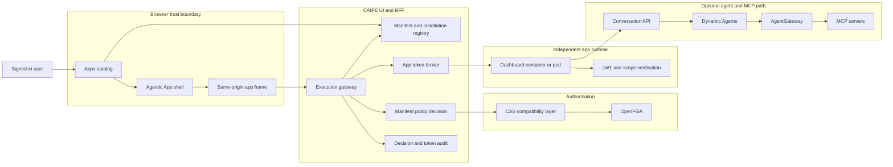
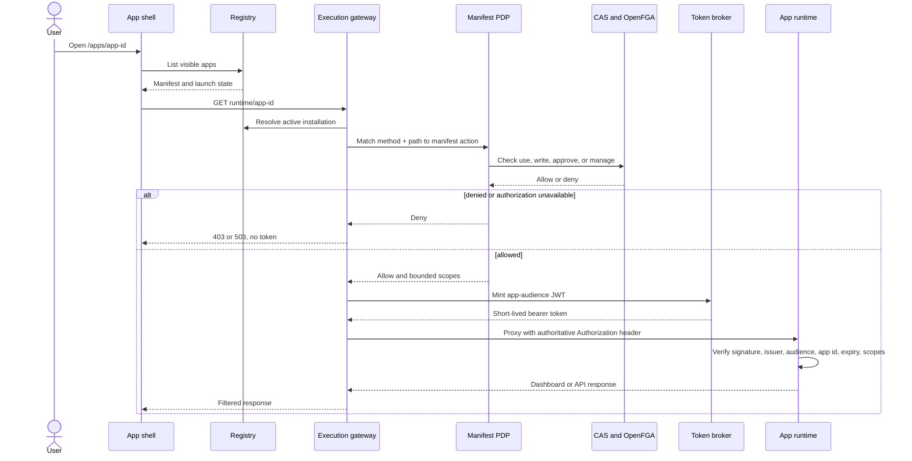
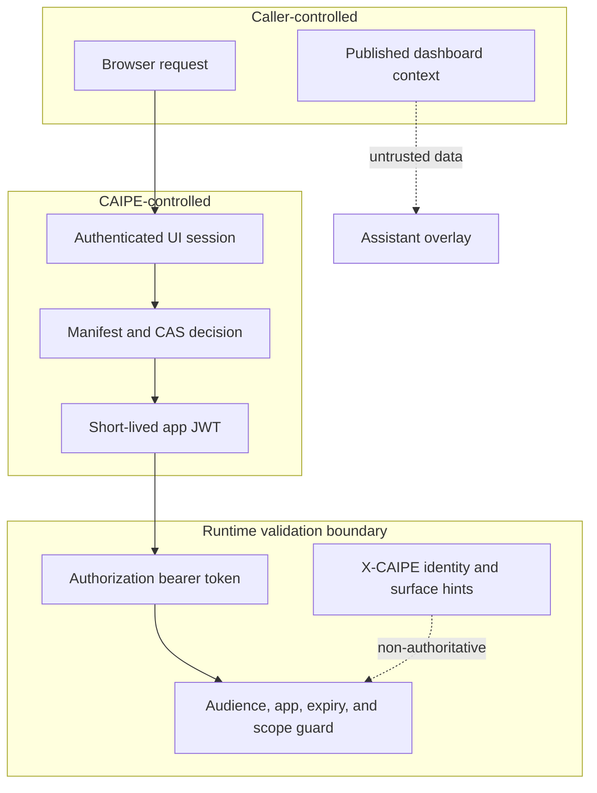
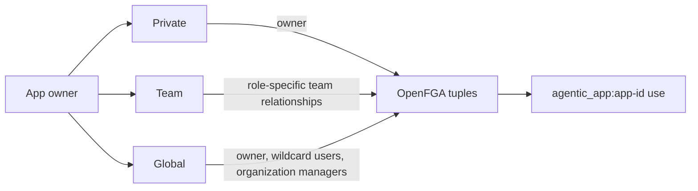
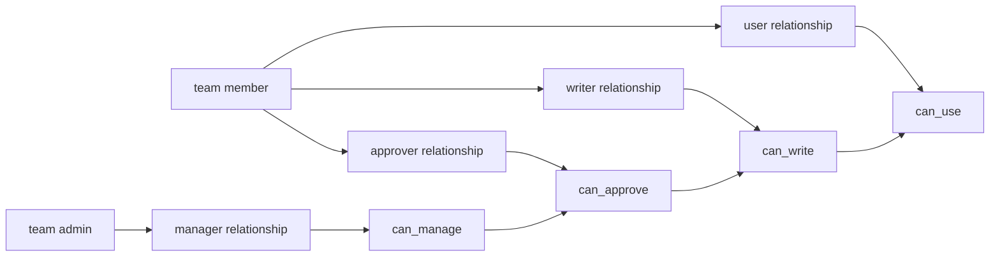
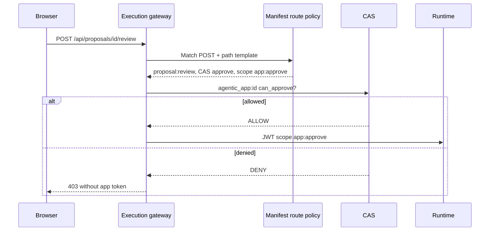
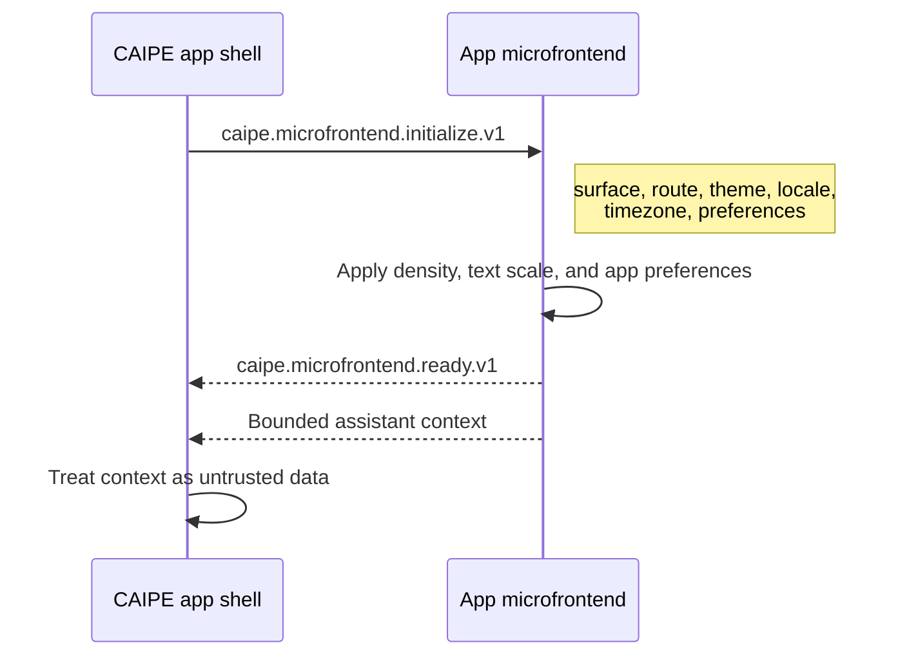
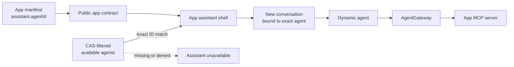

# Agentic Apps Architecture

Agentic Apps are independently owned web runtimes presented inside the CAIPE
UI. CAIPE remains the front door for identity, application discovery,
authorization, token exchange, customization, assistant context, and audit.

An environment exposes only the app IDs selected by `AGENTIC_APPS_ENABLED`.
The built-in packages available to operators in this change are:

- Agentic SDLC
- FinOps Command Center
- LiteLLM Operations
- Weather Lab
- OSS Repo Report Card
- Jira Project Dashboard

The TOME knowledge product remains part of CAIPE, but it is not an Agentic App
dashboard.

## Design goals

- Give each app a stable browser URL: `/apps/<app-id>`.
- Keep runtime origins and credentials out of the browser.
- Enforce both manifest policy and CAS/OpenFGA before runtime access.
- Mint short-lived, least-privilege tokens for a single app audience.
- Let app teams deploy independently behind one CAIPE execution gateway.
- Treat app-provided assistant context as untrusted data, never instructions.

## System topology



| Component | Responsibility |
|---|---|
| App catalog | Returns only apps the signed-in user can view or launch. |
| App shell | Owns navigation, chrome, customization, iframe lifecycle, and assistant overlay. |
| Registry | Resolves built-in manifests plus MongoDB-backed packages and installations. |
| Execution gateway | Proxies the runtime request, strips caller-controlled identity, and injects an app token. |
| Manifest PDP | Allows only declared actions, resources, and scopes. |
| CAS/OpenFGA | Enforces route-specific `use`, `write`, `approve`, or `manage` capabilities and sharing relationships. |
| App runtime | Verifies the app token and applies route-level read or invoke scope. |
| AgentGateway | Independently enforces agent, MCP server, and MCP tool authorization. |

## Request and authorization flow

The browser never connects to a runtime origin directly. The private
same-origin route `/api/agentic-apps/runtime/<app-id>/*` is the only execution
front door.



CAS mode defaults to `enforce`. Authorization errors fail closed. The gateway
records the decision and token grant metadata without storing the raw token.

## Trust boundaries and headers



Security invariants:

- Client-supplied `Authorization`, cookies, forwarding headers, and identity
  hints are removed at the gateway.
- The gateway uses the standard `Authorization: Bearer <token>` header. It does
  not use `X-CAIPE-Token`.
- `X-CAIPE-App-Id`, `X-CAIPE-User`, `X-CAIPE-Roles`, surface, and correlation
  headers are diagnostic hints only. A runtime must not authorize from them.
- The token audience is `agentic-app:<app-id>` and its scopes come from the
  selected manifest action.
- Production runtimes cannot disable JWT verification.
- Unsafe framing, cookie, content-length, and transfer headers are filtered on
  the proxied response.

## CAS sharing model

Apps use the same Private, Team, and Global sharing semantics as other CAIPE
resources.



- The owner relationship is always retained.
- Team sharing stores one explicit role per team and projects it into OpenFGA.
- Global sharing grants use to all users and management to organization
  administrators.
- Built-in global apps are reconciled at startup. Non-global apps do not
  receive a public wildcard grant.
- Sharing changes reconcile tuple differences; they do not bypass manifest
  action or scope checks.

### Team access matrix



| App role | OpenFGA projection | Effective capabilities |
|---|---|---|
| Viewer | `team:<slug>#member user agentic_app:<id>` | View and launch |
| Editor | `team:<slug>#member writer agentic_app:<id>` | Viewer plus propose and refresh |
| Approver | `team:<slug>#member approver agentic_app:<id>` | Editor plus proposal review |
| Admin | `team:<slug>#admin manager agentic_app:<id>` | Approver plus publish, rollback, and access management |

The Security dialog is backed by the persisted matrix and displays the current
user's effective permissions and matching relationship. UI labels do not grant
capability. For example, an approve route receives an app JWT containing an
`<app-id>:approve` scope only after CAS confirms
`agentic_app:<app-id>#can_approve`.

### Route-to-scope contract



Write routes must be declared explicitly. A generic `POST` policy is not a
substitute for route-level authorization; unmatched mutations fail closed.

## Hosted microfrontend contract

The shell and runtime communicate through a versioned `postMessage` contract.
Both sides validate the exact origin, source window, app ID, route, and
contract version.



The host owns shared preferences such as density and text scale. App manifests
declare any additional settings, for example weather units or report-card
staleness thresholds. This keeps the shell contract stable while allowing app
specific customization.

Trusted first-party apps use a same-origin iframe through the gateway. An
untrusted app must declare a sandboxed runtime kind and receive a narrower
browser capability set.

## Agent and MCP calls

Runtime access does not imply agent access.



The assistant identity is configuration, not presentation. `agentName` controls
the label shown to users; `agentId` binds the runtime:

```js
assistant: {
  enabled: true,
  agentId: "example-agent",
  agentName: "Example Assistant",
  label: "Ask Example",
}
```

Every enabled assistant must also declare exactly which required app-agent
dependency owns that identity:

```js
agents: [{
  id: "example-app-agent",
  displayName: "Example Assistant",
  required: true,
  dynamicAgentId: "example-agent",
}]
```

Manifest validation rejects an enabled assistant without `agentId`, or when
`assistant.agentId` does not match a required `agents[].dynamicAgentId`. Each
deployed app must provision that dynamic agent and grant its users `agent#use`.
Apps that do not need an agent must declare `assistant.enabled: false` rather
than inheriting a generic platform assistant.

Deployment readiness for an agent-enabled app requires all of the following:

- the declared dynamic agent exists, is enabled, and is unique to the app;
- intended users can pass `agent:<agent-id>#use`;
- every MCP server and tool in the agent allowlist is registered and reachable
  through AgentGateway;
- mutation tools define human-approval interrupts and least-privilege grants;
- the app assistant fails closed when any required dependency is unavailable.

When `assistant.agentId` is present, the shell selects that exact ID from
`/api/dynamic-agents/available`, which is already filtered through CAS/OpenFGA.
It does not use the user's default agent, the platform default, or the first
available agent. If the configured agent is absent, disabled, or unauthorized,
the assistant is not rendered. Changing the binding remounts chat so an older
conversation cannot continue against the previous agent.

1. The shell creates a server-owned conversation for the configured agent.
2. CAIPE independently checks `agent:<agent-id>#use` for the signed-in user.
3. Dynamic Agents carries the authenticated identity to AgentGateway.
4. AgentGateway checks MCP server and tool grants before forwarding a call.
5. App-published page context is bounded and labeled as untrusted data.

An app may also be static-only. Static dashboards omit the agent path and use
only their declared read scope.

## Deployment patterns

| Pattern | Use | Constraint |
|---|---|---|
| Singleton runtime | Interactive dashboards and APIs | Keep a long-running deployment or pod behind the gateway. This is the reference pattern. |
| Shared static runtime | Several trusted, immutable dashboards | Give each app its own manifest, URL prefix, audience, and scopes even when one server hosts the files. |
| Render job plus static runtime | Agents periodically generate HTML or JSON | The job publishes versioned artifacts to object storage or a PVC; a long-running runtime serves them. A completed Job is not a browser endpoint. |

For dynamic static content, prefer immutable, versioned folders and an atomic
pointer to the active version. An object-store-aware static server can discover
new versions without reloading NGINX. If NGINX config must change, generate and
validate a complete config, swap it atomically, and use a graceful reload; do
not append ad hoc location blocks to a running container.

An OAuth2 Proxy can protect the cluster ingress as defense in depth, but it
does not replace the CAIPE session, manifest policy, CAS/OpenFGA decision, or
runtime token verification.

## API contract

| Endpoint | Purpose |
|---|---|
| `GET /api/agentic-apps` | Return the signed-in user's visible catalog and launch state. |
| `POST /api/agentic-apps/<app-id>/authorize` | Exchange a UI session and allow decision for a short-lived token for an explicitly declared action. |
| `/api/agentic-apps/runtime/<app-id>/*` | Authorize and proxy browser traffic to the resolved runtime. |
| `POST /api/chat/conversations` | Create the server-owned conversation required before an app invokes an agent. |
| `POST /api/v1/chat/invoke` | Invoke the selected agent using that authorized conversation. |

## Failure behavior

| Condition | Result |
|---|---|
| No authenticated UI session | Login for top-level navigation; no login page inside the iframe. |
| App not installed or disabled | Not found or unavailable launch state. |
| Undeclared action or scope mismatch | 403; no token is minted. |
| CAS deny | 403; no runtime request. |
| CAS unavailable in enforce mode | 503; fail closed. |
| Invalid, expired, or wrong-audience app token | Runtime returns 401. |
| Valid token without route scope | Runtime returns 403. |
| Agent or MCP grant denied | Dashboard may remain readable, but the downstream action is denied. |

## Adding an app

1. Define a stable app ID and manifest.
2. Declare runtime origin, mount path, chrome, catalog metadata, actions, and
   least-privilege scopes.
3. Implement runtime JWT verification and route-level scope checks.
4. Integrate the versioned microfrontend client.
5. Add Private, Team, or Global sharing metadata and reconcile OpenFGA tuples.
6. Add static fixtures that are visibly labeled as sample data.
7. Test allow, deny, unavailable authorization, wrong audience, expired token,
   insufficient scope, iframe loading, customization, and agent/MCP denial.

See [AgentGateway](./gateway.md) for downstream MCP enforcement and
[RBAC architecture](../security/rbac/architecture.md) for the broader OpenFGA
model.
