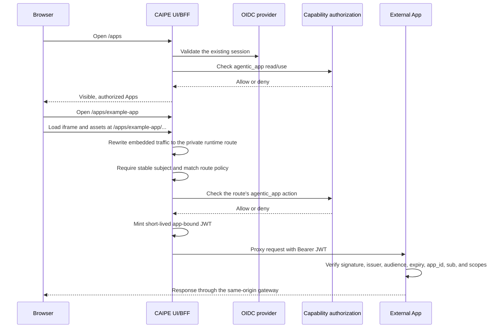

# External Apps

External Apps are independently deployed web applications that appear in the
CAIPE **Apps** hub. The host supplies navigation and authenticated access; the
application keeps ownership of its user experience, data, and domain-specific
authorization.

This integration is useful when a product should be discoverable from CAIPE
without rebuilding it as a CAIPE agent or merging its source into the UI.

## Request flow



The browser never receives the runtime's private origin or the signing secret.
It also never performs a token exchange. The BFF mints a fresh token for each
proxied request after access and route policy checks succeed.

`/apps/<id>` is the single canonical browser and application base URL. A
top-level document reaches the hosted shell. The Apps hub uses a normal document
navigation for launches; iframe, asset, and fetch requests then use the same URL
prefix and are internally rewritten to `/api/agentic-apps/runtime/<id>`. This
lets a bundled application use one stable base path while the private runtime
route remains an implementation detail.

Routes outside `/apps` remain unframeable. The Apps surface and private runtime
route permit only same-origin framing so registered applications can render in
the host shell without allowing cross-origin embedding.

## Trust boundary

The app-scoped JWT is the authoritative identity contract:

| Claim | Meaning |
| --- | --- |
| `sub` | Stable subject from the authenticated OIDC session. Required. |
| `aud` | `agentic-app:<app-id>`. Prevents accidental cross-app replay when verifiers enforce it. A holder of the shared signing secret can still forge another app's token. |
| `app_id` | Registered destination application. |
| `iss` | Host issuer, `caipe-agentic-apps` unless configured otherwise. |
| `scp` / `scope` | Scopes granted by the matched route policy. |
| `name`, `email` | Optional display metadata. Never authorization keys. |
| `decision_id`, `correlation_id`, `jti` | Per-request tracing identifiers. |
| `iat`, `exp` | Five-minute token lifetime by default. |

The gateway strips browser cookies, `Authorization`, conventional proxy
identity headers, all `X-CAIPE-*` headers, and destination-specific identity
headers before adding its own values. `X-CAIPE-*` response/request hints are
useful for logs, but an app must authorize only after verifying the Bearer JWT.

The signing key is symmetric in this first contract. Set a dedicated
`AGENTIC_APP_TOKEN_SECRET` of at least 32 random bytes in both the CAIPE UI and
each registered app. Do not reuse `NEXTAUTH_SECRET`. Because this first slice
uses one verifier secret, every registered runtime that receives it is inside
the same token-signing trust boundary. Per-app keys or host-only asymmetric
signing with JWKS are required before treating runtimes as mutually untrusted.

## Configure the host

Enable the feature and mount one YAML file into the UI container:

```text
AGENTIC_APPS_INSTALL_ENABLED=true
AGENTIC_APPS_CONFIG_PATH=/etc/caipe-ui/agentic-apps.yaml
AGENTIC_APP_TOKEN_SECRET=<dedicated-shared-secret>
AGENTIC_APP_TOKEN_ISSUER=caipe-agentic-apps
AGENTIC_APPS_CAS_MODE=enforce
```

The catalog is deployment-owned. It is not written to MongoDB and contains no
built-in or vendor-specific registrations.

`proxied-next-zone` is retained as the compatible manifest identifier from the
previously accepted contract; it does not by itself promise support for an
embedded Next.js App Router transport.

```yaml
agentic_apps:
  packages:
    - package_id: example-app
      source: helm
      manifest:
        id: example-app
        displayName: Example App
        description: Example independently deployed application.
        apiVersion: "1.0"
        runtime:
          kind: proxied-next-zone
          origin: http://example-app.example.svc.cluster.local
          mountPath: /apps/example-app
          preserveMountPath: false
          chrome: iframe
          # Optional per-app limit. The default is 10 MiB; the maximum is 64 MiB.
          maxRequestBodyBytes: 67108864
        surfaces:
          showInHub: true
          navOrder: 50
        access:
          requiredRoles: [user]
          tokenScopes: [example-app:read, example-app:run]
          policyActions:
            - action: proxy:GET
              defaultEffect: allow
              requiredScopes: [example-app:read]
            - action: create-report
              method: POST
              path: /api/reports
              defaultEffect: allow
              requiredScopes: [example-app:run]
              casAction: write
        authorization:
          resourceType: agentic_app
          launchAction: use
        health:
          endpoint: /health
        catalog:
          categories: [example]
          capabilities: [reports]
  installations:
    - app_id: example-app
      package_id: example-app
      installed: true
      enabled: true
      visible: true
      runtime_mount_path: /apps/example-app
      runtime_origin_override: http://example-app.example.svc.cluster.local
```

The UI validates the whole catalog at startup. Invalid IDs, non-HTTP origins,
missing packages, duplicate mounts, unsupported runtime kinds, and malformed
policy declarations stop startup instead of silently exposing a partial
catalog. ConfigMap volume updates are read on subsequent requests.

## Try the Weather example

The repository includes an opt-in
[Weather reference runtime](https://github.com/caipe-io/ai-platform-engineering/tree/main/ui/examples/external-apps/weather)
that exercises this contract end to end:

- a standalone Node.js application, separate from the CAIPE UI;
- live forecast and air-quality data from Open-Meteo, with no provider key;
- browser assets and API calls rooted beneath `/apps/weather/`;
- independent verification of the app-scoped JWT; and
- separate read and write scopes, including an exact mutation route.

It is a hosting example, not the CAIPE Weather agent. Merging or building the
repository does not start, register, or expose it.

To try it with a locally running CAIPE UI, generate one secret of at least 32
bytes and provide the same value to both processes. Start the example from the
`ui` directory:

```bash
AGENTIC_APP_TOKEN_SECRET='paste-the-same-generated-secret-here' \
  node examples/external-apps/weather/server.mjs
```

Then start the UI with the committed opt-in catalog:

```bash
AGENTIC_APPS_INSTALL_ENABLED=true \
AGENTIC_APPS_CONFIG_PATH="$PWD/examples/external-apps/weather/agentic-apps.yaml" \
AGENTIC_APP_TOKEN_SECRET='paste-the-same-generated-secret-here' \
AGENTIC_APPS_CAS_MODE=off \
  npm run dev
```

After signing in, open `/apps` and select **Weather**. The example README also
documents its container build, routes, and trust boundary.

## Route policies

Routes fail closed. A request is proxied only when one of these rules matches:

- An exact `method` and `path` policy. `:parameter` matches one path segment.
- A compatibility action named `proxy:<METHOD>` when no route-specific policy
  exists for that method.

Use exact route rules for mutations and assign only the scopes needed by that
operation. Method-wide rules are convenient during an initial integration but
grant every declared app scope when `requiredScopes` is omitted.

## Application requirements

The external application must:

1. Be reachable from the CAIPE UI pod at the configured private HTTP(S) origin.
2. Serve browser traffic beneath the same-origin gateway prefix supplied in
   `X-Forwarded-Prefix`. For example, a Vite build for `example-app` uses
   `base: "/apps/example-app/"`. Root-relative `/assets` or `/api` URLs escape
   the app's canonical prefix and will not work.
3. Verify HS256 with the dedicated signing secret.
4. Verify `iss`, `aud`, `app_id`, `exp`, and a non-empty `sub` before trusting
   `name`, `email`, or scopes.
5. Require the appropriate `scp` value for every operation.
6. Avoid session cookies; the gateway deliberately removes them.
7. Keep its own resource model and fine-grained domain authorization.

This first runtime contract is tested for base-path-capable SPAs and ordinary
HTTP assets/fetches. Host launch links use full document navigation. An embedded
Next.js App Router application's RSC/client-navigation transport is not part of
the supported contract yet and requires a dedicated end-to-end fixture before
it can be claimed.

The host treats configured origins as trusted first-party applications. It
removes upstream framing restrictions so the response can render inside the
same-origin Apps shell. The iframe is intentionally unsandboxed: its JavaScript
can access the parent DOM and browser storage and can make same-origin CAIPE
requests with the user's session. The gateway also replaces the runtime's
framing/CSP response headers with host policy, which is report-only in this
initial slice. `SAMEORIGIN` prevents cross-origin framing; it does not isolate a
registered app from CAIPE. Do not register arbitrary or less-trusted websites.
Use a separate-origin or sandbox/message-channel design before widening the
publisher trust boundary.

## Current authorization scope

Every mirror deployment-configured app is protected by the shared
`agentic_app` CAS/OpenFGA resource. The host checks `read`, `use`, and `manage`
for catalog behavior and checks a route's `casAction` before minting scopes.
Manifests without explicit authorization metadata use `use` as the compatible
launch and route action.

The Apps security dialog persists Private, Team, or Global sharing in MongoDB
and projects that intent into OpenFGA. Startup reconciliation reads the
persisted visibility first, so a restart cannot restore a restricted app's
global wildcard grant.

`AGENTIC_APPS_CAS_MODE` controls enforcement:

- `enforce` (default) fails closed when authorization denies or is unavailable;
- `shadow` evaluates CAS while allowing the request; and
- `off` skips the external authorization call for standalone local examples.

The external application's JWT verification and domain-specific authorization
remain mandatory. The host CAS decision is an outer discovery and proxy gate;
it does not replace authorization inside the application.

The parser accepts existing `health.blockLaunchWhen` and installation
`health_policy` metadata for catalog compatibility, but this first slice does
not run active health probes or use health state as an admission decision.
Runtime connection failures return `502 upstream_unavailable`. Health-based
launch admission is a separate follow-up.

The runtime currently buffers request bodies before forwarding them. Requests
default to a 10 MiB per-app limit and receive `413 request_body_too_large` when
they exceed it. Set `runtime.maxRequestBodyBytes` when an application needs a
larger upload/import contract, up to the per-app ceiling of 64 MiB. The host
keeps one additional MiB of transport headroom so an oversized request can be
rejected cleanly rather than forwarded as a truncated body.

Every reverse proxy or ingress in front of the UI must also admit the configured
per-app limit plus that transport headroom. For example, an app configured for
64 MiB requests needs an upstream allowance of at least 65 MiB; otherwise the
upstream proxy will reject the request before the app-specific limit is applied.
