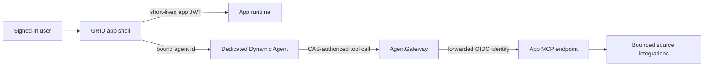

# Agentic app runtimes

The runtime image serves embedded dashboards from `ui/apps/`.

See the [Agentic Apps architecture](../../docs/docs/architecture/agentic-apps.md)
for the system topology, trust boundaries, CAS sharing model, and deployment
patterns.

## Required app-agent-MCP triplet

Every interactive dashboard is deployed as one reviewable triplet:



- The manifest binds the dashboard to one `assistant.agentId` and fails closed when it is absent.
- `deploy/caipe/agent.yaml` binds that agent to exactly one app MCP server and tool allowlist.
- `deploy/caipe/mcp-server.yaml` declares the target endpoint, transport, and forwarded identity mode.
- The app container serves both its dashboard and `/mcp`; there is no second data implementation to drift.
- AgentGateway and CAS/OpenFGA remain the policy enforcement point.
- A runtime may set its app-specific `AGENTIC_APP_*_MCP_AUTH_DISABLED=true` only when its MCP port
  is private, AgentGateway is the sole ingress, and the runtime shares AgentGateway's trusted network.
  Runtimes exposed through any other path must retain forwarded-bearer validation.
- Dashboard context is untrusted navigation context. Agents must call MCP tools for factual answers.

| App | Dedicated agent | MCP server | Tools |
| --- | --- | --- | --- |
| Agentic SDLC | `agent-agentic-sdlc` | `agentic_sdlc` | repository snapshot, runtime contract |
| FinOps | `agent-finops` | `finops_app` | capabilities, LiteLLM cost dashboard |
| LiteLLM | `agent-litellm-finops` | `litellm_app` | daily activity, model inventory |
| Weather | `agent-weather-agent` | `weather_app` | live weather dashboard |
| OSS Repo Report Card | `agent-oss-repo-report-card` | `oss_repo_report_card` | report card, Markdown report |
The source-backed contracts are read-only. Jira Project Dashboard remains a host-configured
integration with project metrics and action cards.

## Interactive invocation contract

Browser dashboards must not invent conversation IDs.

1. Call `POST /api/chat/conversations` with the selected `agent_id`.
2. Read `data.conversation._id` from the response.
3. Pass that server-issued ID to `POST /api/v1/chat/invoke`.

Use `renderAgenticAppConversationClient()` from
`_lib/conversation-client.mjs`. It preserves the Web UI session, agent
authorization, conversation ownership, and audit trail.

## CAS authorization contract

Every hosted request has two independent authorization boundaries:

1. GRID checks `agentic_app:<app-id>#use` through CAS/OpenFGA.
2. GRID evaluates the manifest action and its `requiredScopes` allowlist.
3. GRID mints a short-lived JWT with audience `agentic-app:<app-id>` and only
   the scopes required by that action.
4. The runtime verifies signature, issuer, audience, app id, expiration, and
   the route-specific scope. `GET`/`HEAD` require the read scope; mutations
   require the invoke scope.
5. Agent calls still create a server-owned conversation and independently
   check `agent:<agent-id>#use`. MCP calls are separately constrained by the
   agent's server/tool grants.

Use the browser SDK when an app needs a token for an explicitly declared
action:

```ts
const grant = await authorizeAppResource({
  appId: "weather",
  action: "agent.invoke.weather",
  scopes: ["weather:agent", "agents:invoke"],
});

await fetch("/api/agentic-apps/runtime/weather/api/copilotkit/weather-agent", {
  method: "POST",
  headers: {
    authorization: `Bearer ${grant.token}`,
    "content-type": "application/json",
  },
  body: JSON.stringify({ city: "Example City", intent: "forecast" }),
});
```

Never persist or log the returned token. A denied or unavailable CAS decision
does not issue a token. Production runtimes cannot disable JWT verification.

## Host customization contract

Hosted dashboards include `renderMicrofrontendClient()` and consume the
versioned `caipe.microfrontend.initialize.v1` message from GRID. The shared
client applies dashboard density and text scale. Each runtime listens for the
`caipe:microfrontend-initialize` event when it owns additional preferences:

- FinOps and LiteLLM apply the default reporting range.
- Weather applies US or metric units.
- OSS Repo Report Card applies the stale-issue threshold.

Keep default dashboard typography at a 16px root size. Smaller text remains an
explicit user preference, not an app default.

## Dashboard surfaces

- `/` renders either the hosted GRID surface or standalone view according to
  the gateway-owned `X-CAIPE-Surface` header.
- `/example` renders a static, network-free fixture for FinOps, Weather,
  LiteLLM Operations, and OSS Repo Report Card.

LiteLLM Operations invokes `LITELLM_AGENT_ID` (default
`agent-litellm-finops`) through the normal conversation and chat APIs. The
agent must be authorized for the user and configured with the standalone
LiteLLM MCP server. The dashboard does not call the LiteLLM API directly.

OSS Repo Report Card loads repository, issue, pull request, commit,
contributor, community-health, and permitted security-alert metrics from the
GitHub REST API in the
server-side app runtime. Configure `OSS_REPO_MANAGEMENT_GITHUB_TOKEN` (or
`GITHUB_TOKEN`) for private repositories and higher rate limits; the token is
never sent to the embedded browser. `OSS_REPO_MANAGEMENT_DEFAULT_REPO` may set
an environment-owned initial `owner/repo`. An agent brief is optional and is
shown only when `OSS_REPO_MANAGEMENT_GITHUB_AGENT_ID` names a real Dynamic
Agent that the signed-in user can use through CAS. Public OpenSSF Scorecard
data is added when available. Generated reports are cached in the browser with
their source timestamp so users can reopen prior snapshots and build a local
star-history series without exposing credentials. Automatic loads also use a
15-minute runtime cache to protect GitHub API limits; set
`OSS_REPO_MANAGEMENT_REPORT_CACHE_TTL_MS` to change it. The explicit Generate
report card action always requests fresh source data.

The report card also applies an evidence-based OSS foundation-readiness rubric:
project and dependency licensing, sampled DCO sign-offs and separately verified
DCO/CLA enforcement, governance and contributor-ladder documents, maintainers
and CODEOWNERS, contribution and conduct guides, roadmap and adopter evidence,
security policy, OpenSSF practices, vendor-neutral governance, and transfer or
contribution agreements. Automated evidence is labeled separately from manual
review; the rubric is not an acceptance grade for CNCF or another foundation.

Static examples are design references only. They are visibly labeled as sample
data and must not be used for operational decisions. When opened through GRID,
their CAS panel shows the live launch decision, token audience, and granted
read/invoke scopes without exposing a user identity or token.
