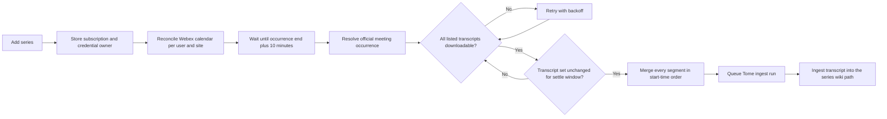

# Tome Webex Meeting-Series Auto-Ingest

Tome can follow recurring Webex meeting series and create an ingest run after
each accessible recorded occurrence has ended and its transcript is available.
The connected user may be the host, a cohost, or a user with whom Webex shared
the recording. Recurring series are supported on regular projects and Areas;
BHAGs remain synthesis-only. This flow is independent of the project's
CRON-based project-source auto-ingest schedule.

An Area meeting ingest is transcript-only. It updates the Area wiki directly
without pulling the Area's attached sources, reading child-project wikis, or
starting a child-project refresh or Area synthesis cascade.

## User Flow

1. Connect the **Webex (Meetings)** application under `/credentials`.
2. Open `/projects/<slug>/tome/settings?tab=auto-ingest`.
3. Under **Recurring Webex meetings**, select **Add series**.
4. Search for a recurring series and add it.
5. Return to the same settings page to see the next occurrence or latest error.
6. Expand a subscribed series to inspect each past occurrence, transcript
   status, ingest result, review link, and run logs.
7. Open `/projects/<slug>/tome/ingest` after a transcript is found to see the
   resulting ingest run.

To find older occurrences, select **Sync now** beside a subscribed series.
Tome performs a fresh lookup over the previous 30 days by default, compares
every ended meeting with its durable occurrence history, and lists only
untracked meetings. Select the meetings to ingest and confirm. This preview
does not queue anything until the user explicitly confirms the selection.

Recurring-series runs and the dedicated **Ingest meeting** action use an
explicit `webex_meetings` source scope. They send only the selected meeting
payload and an empty attached-source snapshot: GitHub reconciliation, GitHub
issue context, Confluence, Webex spaces, and other project-source pulls are
not run. **Full ingest** may still include a selected meeting as additional
context while processing the project's normal attached sources.

If a meeting ingest run fails, its history row exposes **Retry**. This is an
explicit user action: Tome preserves the failed run, copies its stored meeting
payload into a new run, and forces the new run to the `webex_meetings` source
scope. It does not retry or repair failed runs automatically.

During **Project Onboarding**, enable auto-ingest and select one or more series
in the **Auto-ingest** step. The picker refreshes Webex when it opens and stores
the chosen subscriptions with the new project. Meeting occurrences still
follow their Webex calendar rather than the daily/weekly project-source
schedule.

For a series hosted by someone else, both onboarding and project settings show
an explicit recording-access warning before allowing selection. Auto-ingest can
process only occurrences whose recording and transcript Webex makes available
to the connected user, such as cohosted or shared recordings.

## One-Off Manual Recorded Meeting Ingest

The ingest page at `/projects/<slug>/tome/ingest` also has a one-off recorded
meeting picker. This is independent of recurring-series subscriptions and does
not create a schedule.

### Discovery and availability

1. The browser requests
   `GET /api/tome/projects/<slug>/webex-meetings?lookbackDays=<days>`.
2. The BFF uses the signed-in user's built-in `webex` connection. The OAuth
   token is never sent to the browser.
3. The BFF queries recordings and meeting transcripts in parallel, merges them
   by Webex meeting instance ID, and returns newest first.
4. The picker defaults to the previous 3 days. The user may choose 3, 7, or 30
   days; the API hard-caps the interactive lookup at 30 days.
5. Summary and transcript badges are checked with bounded concurrency and
   request deadlines so a stalled Webex call cannot leave the picker loading
   forever.
6. Transcript availability first checks the public transcript API. If that is
   empty, the BFF verifies the exact User Hub recording stream and its
   `transcriptURL`. This is why an accessible recording hosted by somebody
   else can show **Transcript available**.

The availability badge is a recent access probe, not cached transcript text.
The actual transcript is fetched again when the user starts the ingest.

### Submit-time transcript fetch

The client sends only the selected meeting metadata and availability flags.
The server reconstructs the allowed ingest item; it does not trust transcript
text supplied by the browser.

For every selection marked with an available transcript:

1. The BFF uses the same signed-in user's built-in `webex` connection.
2. It invokes the configured normal `webex_meetings` MCP endpoint directly.
3. It calls the same `downloadMeetingTranscript` helper used by recurring
   auto-ingest. That helper tries the public transcript endpoint, then the
   authenticated User Hub shared/cohost fallback, and downloads the text.
4. Public recording topics sometimes contain a Webex-generated suffix such as
   `-20260909 1651-1`. The manual path removes that suffix for User Hub title
   lookup only; the original title remains visible and is retained in the
   ingest payload.
5. The downloaded transcript is capped by
   `TOME_WEBEX_TRANSCRIPT_MAX_CHARS` and embedded in the TOME request. The
   agent consumes this inline transcript and does not call its older
   public-only transcript tool.

Up to three selected transcripts are fetched concurrently. A meeting that has
only a summary badge is passed without inline transcript text, so the TOME
agent may still request its summary through the compatibility Webex tools.

If the picker reported a transcript but Webex no longer returns a downloadable
body, the API returns
`WEBEX_MEETING_TRANSCRIPT_UNAVAILABLE` before creating an ingest run. The
user must refresh the list and try again. There is no automatic retry, recovery,
or mutation of an earlier run.

### Source scope

- **Full ingest** with **Add context: recorded Webex meetings** keeps the normal
  project ingest scope. TOME processes attached GitHub, Confluence, Webex-space,
  and other sources and uses the selected meeting as additional context.
- The dedicated **Ingest meeting** action on a regular project sends
  `sourceScope: "webex_meetings"`, so only the selected meeting payload is
  processed.
- A one-off meeting selection is per-run. It is not saved as a recurring-series
  subscription.

## Manual Actions and Safety Boundaries

Neither **Sync now** nor **Retry** is an automatic migration or repair:

- **Sync now** `GET` is read-only. It performs a fresh Webex lookup and previews
  untracked ended occurrences within the configured lookback window.
- **Ingest selected** queues only the occurrence keys the editor explicitly
  checked in the Sync dialog.
- **Retry** is shown only when a tracked occurrence has a linked ingest run in
  `failed` state. It does not retry transcript-discovery failures or skipped
  occurrences; use **Sync now** to inspect historical availability instead.
- Retry preserves the original failed run and report for audit/history. It
  copies the original run's stored `webexMeetings` payload into one new queued
  run and updates the occurrence to point at that new run.
- The retry endpoint atomically claims the failed occurrence. A concurrent
  second click receives a conflict instead of creating a duplicate run.
- A run without a stored meeting payload is rejected rather than reconstructed
  or guessed.
- There is no startup scan, one-time recovery, bulk status reset, implicit
  requeue, or persisted-state migration for old meeting runs.

Meeting ingests that failed on the old malformed GitHub repository source are
retryable when they appear in occurrence history: those runs already stored the
Webex meeting/transcript payload before failing. The new run always adds the
meeting-only source scope, even when the failed run predates that field.

## Meeting-Only Source Isolation

| Entry point | Source behavior |
|---|---|
| Recurring meeting-series scheduler | Meeting-only: selected occurrence/transcript only. |
| Dedicated **Ingest meeting** action | Meeting-only: selected meeting only. |
| **Full ingest** with a selected meeting | Combined: normal project sources plus meeting context. |

For an explicit meeting-only run, the UI/API require at least one meeting and
store `sourceScope: "webex_meetings"` on the run dispatch. Run preparation then:

1. Skips GitHub source reconciliation and canonicalization.
2. Skips GitHub issue/discussion cache loading and issue context.
3. Skips project roll-up discovery used for attached-source context.
4. Passes a scoped project snapshot with `sources: {}`.
5. Applies the same empty-source rule again in the agent request builder as
   defense in depth.

This excludes GitHub repositories, Confluence, Webex spaces, Area child-project
wikis, and every other attached source from the meeting-only request.

## Execution Flow



The scheduler loop runs once per minute by default, but this does **not** call
Webex once per minute. Each tick checks MongoDB for due calendar or transcript
work. Calendar discovery is grouped by credential owner and Webex site, so ten
series owned by the same user normally share one discovery sweep.

## Timing

| Event | Behavior |
|---|---|
| Series added or re-enabled | Request an immediate owner/site calendar refresh; the shared group is normally reconciled on the next scheduler tick. |
| Calendar refresh | Once daily by default, shared by all series for one user/site. |
| Sync now | Immediately performs a fresh historical lookup for that series. Selected missing meetings enter the normal transcript/ingest worker queue. |
| Retry failed ingest | Explicitly queues a new meeting-only run from the failed run's stored Webex payload; the failed run remains available in logs. |
| Upcoming occurrence | The next check is moved earlier to occurrence end plus 10 minutes. |
| First transcript attempt | Occurrence end plus 10 minutes, on the next scheduler tick. |
| Webex reports a meeting as missed | Still check User Hub during the retry window, because a shared/cohost recording may exist without a public instance; skip only if no accessible transcript appears. |
| Series hosted by someone else | The settings UI permits it after an access warning. Each occurrence is ingested only when its recording and transcript are available to the subscribing user's Webex account. |
| Transcript unavailable | Retry with backoff (15 minutes, 30 minutes, then 1 hour) within the configured maximum retry period. |
| Transcript found | Wait until all listed bodies download and the transcript IDs/content remain unchanged for 15 minutes by default. |
| Additional segment appears | Reset the transcript settle window, then merge every segment in start-time order. |
| Transcript deadline | Stop retrying 2 hours after the occurrence ended by default. |
| Another ingest is running for the same Tome entity | Keep the occurrence ready and retry after 5 minutes. If that run is awaiting review, show a collapsed **Warning: needs attention** message with a link to the blocking review. |
| Discovery failure | Retry the owner/site calendar after 15 minutes. |

An occurrence that ended before the subscription was created is not silently
backfilled. It can be selected explicitly through **Sync now**. Selecting a
series while its meeting is in progress is supported. Cancelled and missed
occurrences are skipped.

Both the project settings picker and Project Review & Create allow a non-hosted
series only after an explicit recording-access warning.

## Discovery

Tome invokes the configured `webex_meetings` MCP server directly. It combines:

- `webex_list_meetings` with `meetingSeries`
- `webex_list_meetings` with `scheduledMeeting`
- `webex_list_meetings` with `meeting`
- `webex_userhub_calendar`

The discovery window covers the previous 48 hours and next 90 days. User Hub
calendar discovery is required because some active recurring meetings do not
appear reliably through `webex_list_meetings` alone.

When an occurrence has no public meeting instance ID, Tome sends its series
title, start time, and Webex site to `webex_list_transcripts`. The MCP server
matches the nearest User Hub recording and returns its `meetingInstanceId` with
the transcript. This supports cohost/shared recordings without treating calendar
attendance alone as proof of recording access.

Webex can report an early or late-started meeting twice: once at its actual time
through the Meetings API and once at its scheduled time through User Hub. Tome
merges nearby cross-source rows within the same series, preferring the actual
Meetings API timing. As a second safety net, resolved rows with the same Webex
`meetingInstanceId` are consolidated before any ingest run is created.

User Hub local wall-clock timestamps are converted to UTC using the IANA
timezone supplied by Webex. Ambiguous timezone-less calendar rows are ignored
rather than interpreted in the UI worker's timezone.

Series identity prefers durable Meetings and User Hub series IDs. Meeting
numbers and personal-room links are weak references: multiple unrelated series
can reuse them and must not be collapsed into one result.

## Authentication and MCP Selection

Both flows use MCP server ID `webex_meetings` and forward the bearer on
`X-CAIPE-Provider-Token`, but they deliberately use different saved provider
connections:

| Flow | Provider connection | Credential owner |
|---|---|---|
| One-off manual recorded-meeting picker and submit | `webex` | Current signed-in user |
| Recurring-series discovery and background ingest | `webex_meetings` | User who added the subscription |

The server ID and provider names are currently fixed in code. The direct MCP
endpoint can be overridden with `TOME_WEBEX_MEETINGS_MCP_URL`. Using a
differently named MCP server or provider requires a code change.

The current **Webex (Meetings)** OAuth connector requests:

- `meeting:schedules_read`
- `meeting:participants_read`
- `meeting:recordings_read`
- `meeting:summaries_read`
- `meeting:transcripts_read`

The built-in **Webex** connection used by one-off ingest must likewise include
the recording, transcript, and summary read grants. It may carry additional
messaging scopes for other CAIPE features, but manual meeting ingest does not
use them. No messaging or KMS scope is required by meeting ingest itself. A
user who connected before these meeting scopes were configured must reconnect
the relevant application so Webex issues a token containing the updated grants.

## HTTP API

All endpoints require Tome project access. Mutating operations additionally
require editor/data-steward permission and validate that the subscription,
occurrence, and run belong to the requested project.

| Endpoint | Method | Purpose |
|---|---|---|
| `/api/tome/projects/<slug>/webex-meeting-series` | `GET` | List subscriptions and occurrence history; `?discover=1` also performs fresh discovery. |
| `/api/tome/projects/<slug>/webex-meeting-series` | `POST` | Add one discovered series. |
| `/api/tome/projects/<slug>/webex-meeting-series` | `PATCH` | Enable or disable one subscription. |
| `/api/tome/projects/<slug>/webex-meeting-series` | `DELETE` | Remove one subscription. |
| `/api/tome/projects/<slug>/webex-meeting-series/sync` | `GET` | Read-only preview of missing historical occurrences. |
| `/api/tome/projects/<slug>/webex-meeting-series/sync` | `POST` | Queue explicitly selected historical occurrence keys. |
| `/api/tome/projects/<slug>/webex-meeting-series/retry` | `POST` | Replay one linked failed ingest as a new meeting-only run. |
| `/api/tome/projects/<slug>/webex-meetings` | `GET` | Discover one-off historical recordings and probe summary/transcript availability; `lookbackDays` is capped at 30. |
| `/api/tome/projects/<slug>/reingest` | `POST` | Prefetch selected one-off transcripts, then start a regular-project full or meeting-only ingest. |
| `/api/tome/projects/<slug>/synthesize` | `POST` | Prefetch selected one-off transcripts before starting BHAG/Area synthesis. |

Retry request:

```json
{ "occurrenceId": "<durable occurrence id>" }
```

A successful retry returns HTTP `202` with the original and new run IDs. It
returns `409` when the run is not failed, lacks a reusable Webex payload, or was
already claimed by another retry.

## Configuration

| Variable | Default | Notes |
|---|---:|---|
| `TOME_AUTO_INGEST_ENABLED` | `false` | Must be `true` to start the scheduler, including meeting-series work. |
| `TOME_AUTO_INGEST_TICK_MS` | `60000` | Local scheduler loop interval. |
| `TOME_WEBEX_SERIES_REFRESH_MS` | `86400000` | Owner/site calendar refresh interval; minimum five minutes. |
| `TOME_WEBEX_RETRO_SYNC_LOOKBACK_DAYS` | `30` | Historical window used by **Sync now**; bounded to 1–365 days. |
| `TOME_WEBEX_ALLOW_NON_HOST_SERIES` | `true` | Allow users to add meeting series hosted by someone else after the recording-access warning. Set `false` to disable this in both onboarding and project settings; write APIs enforce the same policy. Existing subscriptions are not removed. |
| `TOME_WEBEX_TRANSCRIPT_SETTLE_MS` | `900000` | Required unchanged time before all transcript segments are merged and queued. Set `0` to disable settling. |
| `TOME_WEBEX_TRANSCRIPT_MAX_RETRY_PERIOD_MS` | `7200000` | Maximum time after a meeting ends to retry resolving its public or User Hub occurrence and transcript. |
| `TOME_WEBEX_TRANSCRIPT_MAX_CHARS` | `400000` | Maximum transcript characters passed to one ingest; minimum 50,000. |
| `TOME_WEBEX_MEETINGS_MCP_URL` | unset | Optional direct endpoint override for the configured MCP server. |

The normal project auto-ingest toggle and CRON do not need to be enabled for a
meeting-series subscription. The global `TOME_AUTO_INGEST_ENABLED` worker flag
does need to be enabled.

## State and Idempotency

MongoDB stores the feature state in three places:

| Location | Purpose |
|---|---|
| `projects.autoIngest.webexMeetingSeries` | Subscriptions, credential owner, next occurrence, and latest status/error. |
| `tome_auto_ingest_cursors` | Replica-safe per-user/site calendar claims and next-check times. |
| `tome_webex_meeting_occurrences` | Per-occurrence status, attempts, retry time, transcript IDs/fingerprint, first stable observation, and ingest run ID. |

Occurrence IDs are deterministic hashes of the project, subscription, and
Webex occurrence key. Before creating a run, the worker also searches for an
existing run with the same occurrence ID. These checks prevent duplicate
ingests after replica races or worker restarts.

Historical sync also compares Webex meeting IDs and nearby cross-source
calendar rows against existing occurrence history. Failed or skipped rows are
already tracked and remain visible in history; **Sync now** does not create a
second ingest row for them.

An explicit failed-run retry transitions the existing occurrence as follows:

```text
failed/queued-with-failed-run -> processing (atomic claim) -> queued (new run)
                                              \-> original status (enqueue error)
```

The previous run row is never rewritten or deleted. Once the new run finishes,
normal reconciliation marks the occurrence `ingested` or `failed`.

Possible occurrence states are `pending`, `processing`, `waiting_transcript`,
`ready`, `queued`, `ingested`, `skipped`, and `failed`.

## Observability

The project settings page shows:

- credential owner (`Runs as`)
- next meeting **start** time
- last ingested occurrence
- latest scheduler or transcript error
- a per-series **Sync now** action for previewing and selecting untracked past meetings
- an expandable history for every subscribed series, including each tracked
  past occurrence, transcript count, ingest state, and links to review changes
  or open the run logs
- waiting-state messages include the exact next scheduled check, formatted in
  the viewer's local timezone
- a **Retry** action on failed meeting ingest runs

The ingest page shows the run only after a transcript has been found and the
run has been queued. There is currently no dedicated attempt-history screen.
Inspect `tome_webex_meeting_occurrences` for the exact attempt count,
`next_attempt_at`, status, and last error.

Follow scheduler logs with:

```bash
kubectl -n <namespace> logs -f deploy/<release>-caipe-ui -c caipe-ui \
  | rg --line-buffered 'WebexSeries|AutoIngest'
```

## Current Limitations

- The settings page displays the next meeting start, not the calculated first
  transcript-attempt time.
- Existing meetings are not backfilled automatically when a series is added;
  **Sync now** provides an explicit, configurable historical window.
- Discovery looks ahead 90 days.
- Host eligibility depends on the Webex host email matching the signed-in
  user's email.
- Webex does not publish an expected transcript count or an explicit
  "all transcripts complete" signal. The configurable unchanged-set window is
  therefore a stabilization heuristic; a segment published after that window
  cannot be added to an already queued run automatically.

## Relevant Code

- `../webex-meeting-series.ts`: MCP selection, credentials, discovery, identity,
  host eligibility, occurrence resolution, transcript download, and one-off
  manual transcript prefetch
- `webex-meeting-series-scheduler.ts`: reconciliation, timing, retries, and run
  creation
- `webex-meeting-series-backfill.ts`: read-only historical comparison and
  explicit queuing of selected missing occurrences
- `cursor.ts`: replica-safe scheduler claims
- `../webex-meeting-history.ts`: occurrence/run join used by settings history
- `../ingest-runner.ts` and `../agent-proxy.ts`: meeting-only source isolation
- `../../../app/api/tome/projects/[slug]/webex-meeting-series/route.ts`: list,
  discover, add, enable/disable, and remove API
- `../../../app/api/tome/projects/[slug]/webex-meeting-series/sync/route.ts`:
  historical preview and selected enqueue API
- `../../../app/api/tome/projects/[slug]/webex-meeting-series/retry/route.ts`:
  explicit failed-run retry API
- `../../../app/api/tome/webex-meeting-series/route.ts`: authenticated pre-create
  discovery for Project Onboarding
- `../../../components/tome/WebexMeetingSeriesSettings.tsx`: settings and
  selection, history, Sync now, and Retry UI
- `../../../components/tome/IngestPanel.tsx`: one-off recorded-meeting picker,
  Full-ingest meeting context, and dedicated meeting-only dispatch
- `../../../app/api/tome/projects/[slug]/webex-meetings/route.ts`: bounded
  historical discovery and summary/transcript availability probes
- `../../../app/api/tome/projects/[slug]/reingest/route.ts` and
  `../../../app/api/tome/projects/[slug]/synthesize/route.ts`: submit-time
  transcript prefetch before a run is created
- `../../../components/projects/OnboardingWebexMeetingSeriesPicker.tsx`:
  onboarding search and multi-select UI
- `../../../../../ai_platform_engineering/mcp/webex-meetings/`: Webex Meetings
  MCP, User Hub calendar discovery, and shared/cohost transcript fallback

## Tests

```bash
cd ui
npm test -- --runInBand --runTestsByPath \
  src/lib/tome/__tests__/auto-ingest-cursor.test.ts \
  src/lib/tome/__tests__/agent-proxy.test.ts \
  src/lib/tome/__tests__/webex-meeting-history.test.ts \
  src/lib/tome/__tests__/webex-meeting-series-backfill.test.ts \
  src/lib/tome/__tests__/webex-meeting-series.test.ts \
  src/lib/tome/__tests__/webex-meeting-series-scheduler.test.ts \
  src/lib/tome/__tests__/auto-ingest-scheduler.test.ts \
  'src/app/api/tome/projects/[slug]/webex-meeting-series/retry/__tests__/route.test.ts' \
  src/components/tome/__tests__/WebexMeetingSeriesSettings.test.tsx
```

The MCP fallback tests live separately:

```bash
cd ai_platform_engineering/mcp/webex-meetings
uv run pytest tests/test_userhub_transcripts.py
```
